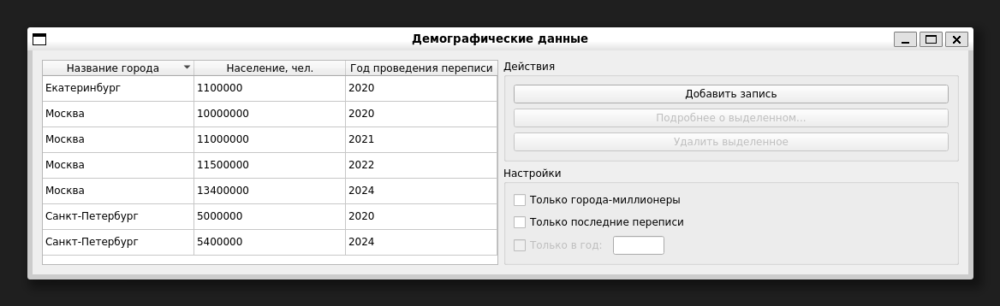
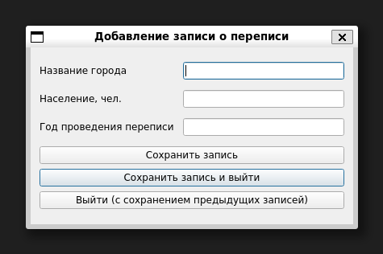
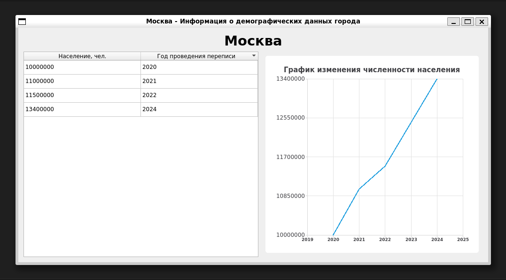

# Приложение для работы с демографическими данными

Данное приложение написано на Qt С++. Оно позволяет хранить данные о переписях в различных населенных пунктах, фильтровать, редактировать и удалять записи, строить графики для городов по годам.

## Запуск в Ubuntu

```bash
sudo apt install g++ qt6-base-dev libqt6core5compat6-dev libqt6charts6-dev libgl1-mesa-dev
qmake6
make
./demographyApp
```

## Работа приложения

*Список записей:*



*Окно добавления записи:*



*График изменения численности:*

